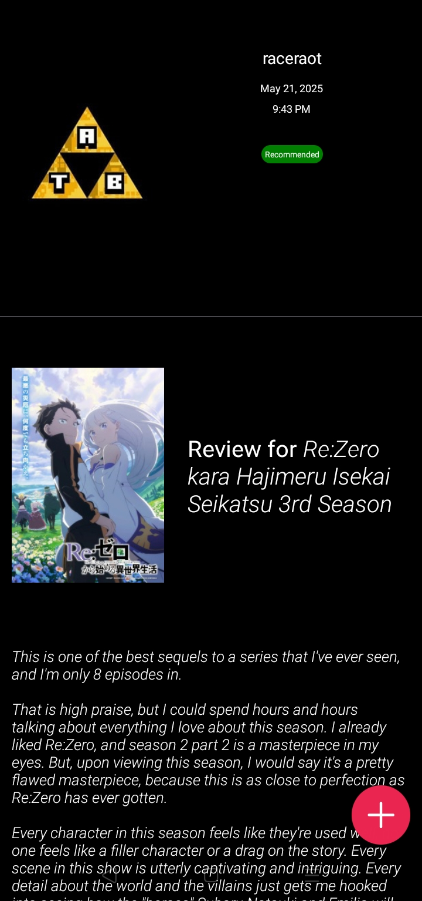

# A-List 📺

A-List is a mobile-friendly React Native app built with Expo that lets users explore the world of anime. It features up-to-date anime reviews, trending titles, and an intuitive search function to discover shows and movies.

## 🚀 Features

- 🔥 Fetches the latest popular anime using public APIs
- 📝 Displays user and critic reviews
- 🔍 Search functionality for finding specific anime titles
- 📱 Built using React Native & Expo for cross-platform support

## 🧰 Tech Stack

- **Framework:** React Native (via Expo)
- **Navigation:** React Navigation
- **Data Fetching:** Axios
- **Persistent Storage:** AsyncStorage

## 🖼 Screenshots

> ### Home Screen 
>
> 
> ### Reviews
> 
> 
> ### Review
> 


## 🔐 Environment Variables

Create a `.env` file in the root folder with the following keys:

```env
API_KEY=your_api_key_here


```
Get API key from [Rapid API](https://rapidapi.com/)

## 📦 Installation

1. Clone the repository:

   ```bash
   git clone https://github.com/onxly/a-list.git
   cd a-list

   ```

2. Install dependencies:

   ```bash
   npm install

   ```

3. Run the app:

   ```bash
   npx expo start
   ```

This project is licensed under the MIT License.

Made with ❤️ by I.K Mofokeng
